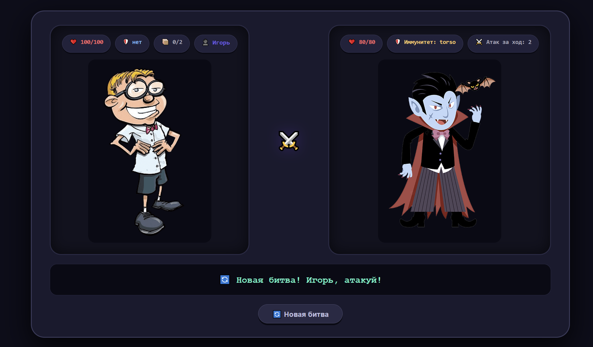

# not-fight-club
Пошаговая браузерная игра в жанре файтинг с настраиваемым игроком, набором противников, механикой атаки/защиты, критическими ударами и журналом боя

Деплой: https://satyricons.github.io/not-fight-club/

Задание: https://github.com/rolling-scopes-school/tasks/blob/master/stage0.5%20Bootcamp/tasks/notFightClub/README.md

Скриншот:

Развертывание:

Выполнено 26.07.2026 / дедлайн 27.07.2026

Оценка: 300 / 300

Экран регистрации +

Ввод позволяет игроку ввести свое имя; введенное имя повторно используется на всех остальных экранах и сохраняется при перезагрузках +

Начальный экран +

Кнопка «Начать» создает новое сражение и открывает страницу сражения +

Страница персонажа +/-

На странице отображается аватар персонажа +

На странице отображается имя игрока и статистика побед/поражений +

Игрок может выбрать новый аватар из набора изображений, и выбранный аватар будет отображаться везде -

Страница настроек -

Игрок может изменить свое имя; новое имя отображается на всех остальных экранах и сохраняется при перезагрузке +/-

Страница боя +

На странице показаны игрок и противник с интерактивными столбиками HP, которые обновляются в соответствии с логикой боя +

Когда создается битва, противник выбирается из заранее определенного пула, состоящего как минимум из 2 противников с разными профилями атаки / защиты +/-

Полная рабочая механика боя в разделе "Механика боя" - выбор зоны, соответствие атаки и защиты, одновременное разрешение, рандомизация противника в профиле, отсутствие повторяющихся зон за один ход +

Реализованы критические удары: случайный шанс нанести дополнительный урон; критический удар также пробивает блок +

Журнал сражений показывает каждое действие каждого хода с обязательными полями (КТО, КОГО, ГДЕ, СКОЛЬКО) +

Записи журнала визуально выделяют ключевые фрагменты информации (разные стили названий, зон, величины урона), как показано в демо +

Бонус - полная стойкость -

Все игровые данные сохраняются, так что после перезагрузки страницы игрок может продолжить игру с тем же персонажем, сохранить свой рекорд побед / поражений и возобновить текущую битву в точно таком же состоянии (HP, текущий ход, журнал) +
 Ввод позволяет игроку ввести свое имя; введенное имя повторно используется на всех остальных экранах и сохраняется при перезагрузках + 
 
Начальный экран +

 Кнопка «Начать» создает новое сражение и открывает страницу сражения +
 
Страница персонажа +/-

На странице отображается аватар персонажа +

На странице отображается имя игрока и статистика побед/поражений +

Игрок может выбрать новый аватар из набора изображений, и выбранный аватар будет отображаться везде -

Страница настроек -

 Игрок может изменить свое имя; новое имя отображается на всех остальных экранах и сохраняется при перезагрузке +/-
 
Страница боя +

 На странице показаны игрок и противник с интерактивными столбиками HP, которые обновляются в соответствии с логикой боя +
 
 Когда создается битва, противник выбирается из заранее определенного пула, состоящего как минимум из 2 противников с разными профилями атаки / защиты +/-
 
 Полная рабочая механика боя в разделе "Механика боя" - выбор зоны, соответствие атаки и защиты, одновременное разрешение, рандомизация противника в профиле, отсутствие повторяющихся зон за один ход +
 
 Реализованы критические удары: случайный шанс нанести дополнительный урон; критический удар также пробивает блок +
 
 Журнал сражений показывает каждое действие каждого хода с обязательными полями (КТО, КОГО, ГДЕ, СКОЛЬКО) +
 
 Записи журнала визуально выделяют ключевые фрагменты информации (разные стили названий, зон, величины урона), как показано в демо +
 
Бонус - полная стойкость -

 Все игровые данные сохраняются, так что после перезагрузки страницы игрок может продолжить игру с тем же персонажем, сохранить свой рекорд побед / поражений и возобновить текущую битву в точно таком же состоянии (HP, текущий ход, журнал) +
